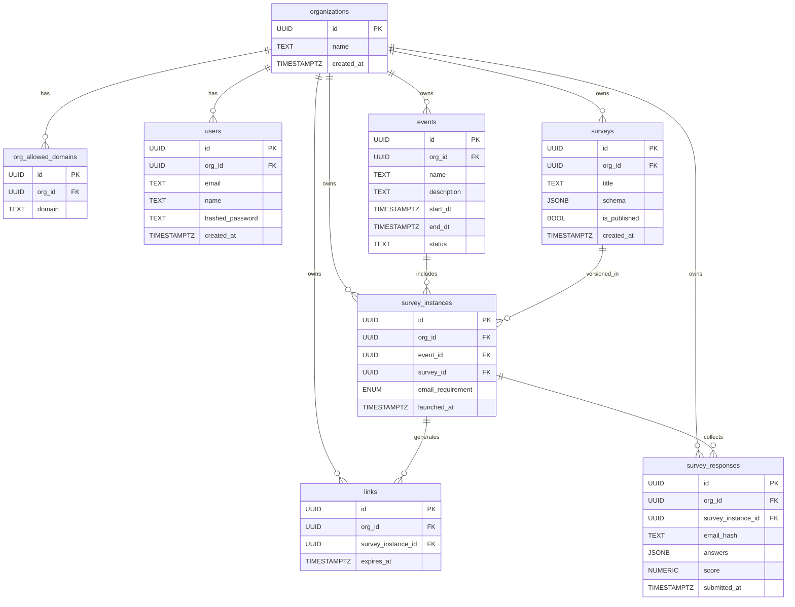

```mermaid
erDiagram
    organizations {
        UUID id PK
        TEXT name
        TIMESTAMPTZ created_at
    }

    org_allowed_domains {
        UUID id PK
        UUID org_id FK
        TEXT domain
    }

    users {
        UUID id PK
        UUID org_id FK
        TEXT email
        TEXT name
        TEXT hashed_password
        TIMESTAMPTZ created_at
    }

    events {
        UUID id PK
        UUID org_id FK
        TEXT name
        TEXT description
        TIMESTAMPTZ start_dt
        TIMESTAMPTZ end_dt
        TEXT status
    }

    surveys {
        UUID id PK
        UUID org_id FK
        TEXT title
        JSONB schema
        BOOL is_published
        TIMESTAMPTZ created_at
    }

    survey_instances {
        UUID id PK
        UUID org_id FK
        UUID event_id FK
        UUID survey_id FK
        %% /* none | optional_any | optional_org */ %%
        ENUM email_requirement
        TIMESTAMPTZ launched_at
    }

    links {
        UUID id PK
        UUID org_id FK
        UUID survey_instance_id FK
        TIMESTAMPTZ expires_at
    }

    survey_responses {
        UUID id PK
        UUID org_id FK
        UUID survey_instance_id FK
        TEXT email_hash
        JSONB answers
        NUMERIC score
        TIMESTAMPTZ submitted_at
    }

    organizations ||--o{ org_allowed_domains : has
    organizations ||--o{ users              : has
    organizations ||--o{ events             : owns
    organizations ||--o{ surveys            : owns
    organizations ||--o{ survey_instances   : owns
    organizations ||--o{ links              : owns
    organizations ||--o{ survey_responses   : owns

    events ||--o{ survey_instances      : includes
    surveys ||--o{ survey_instances     : versioned_in
    survey_instances ||--o{ links       : generates
    survey_instances ||--o{ survey_responses : collects
```